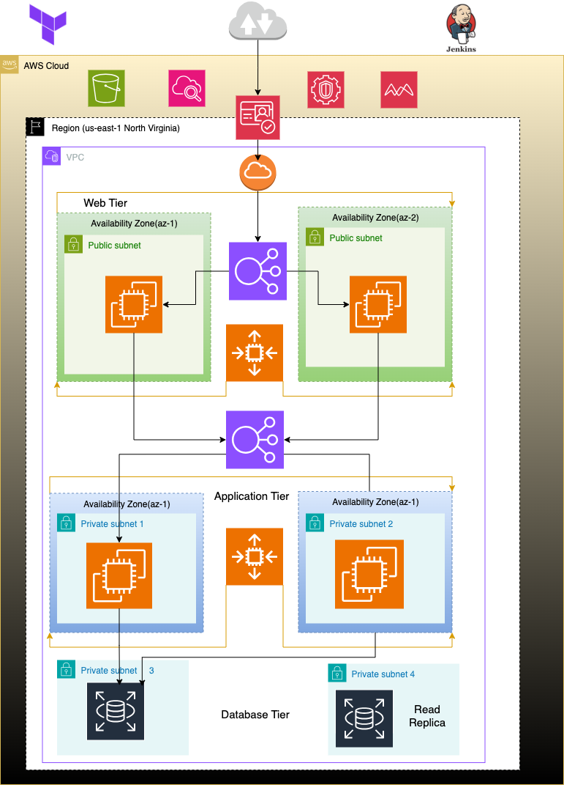

🚀 Project Overview
This project i build provides the complete source code and Infrastructure as Code (IaC) to deploy a highly available, scalable, and resilient multi-tier architecture on Amazon Web Services (AWS) using Terraform for full automation.

The solution is built following industry best practices for modular, secure, and maintainable cloud infrastructure.

🏗️ Architecture Overview
The architecture is organized into the following tiers:

1. Web Tier 🌐⚖️
Handles all incoming user traffic using web servers behind an Application Load Balancer (ALB). This tier is horizontally scalable, allowing seamless response to fluctuating traffic demands.

2. Application Tier 🧠🔄
Runs the core business logic. Application servers are designed for stateless processing, allowing efficient auto scaling. This tier communicates with the database layer and is optimized for high availability and fault tolerance.

3. Database Tier 🗄️🔐
Uses Amazon RDS to provide a fully managed, secure, and scalable relational database service. It supports multi-AZ deployments for increased availability and automated backups for data protection.

🔧 Integrated Services
• AWS Cognito 🔐🧑‍💼
Provides secure user authentication and authorization, including user sign-up, sign-in, and access control. Supports identity federation with third-party identity providers such as Google and Facebook.

• Jenkins CI/CD 🔄🚀
Implements a continuous integration and delivery pipeline to automate build, test, and deployment processes. Jenkins ensures faster, more reliable updates across all tiers of the application.